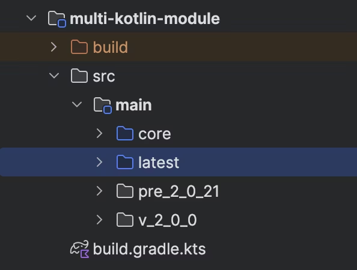
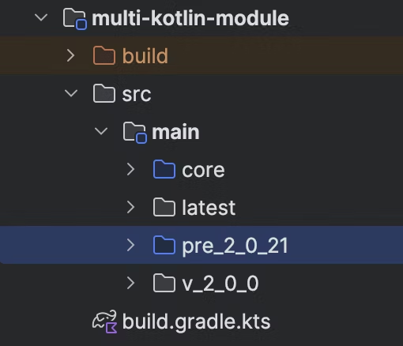
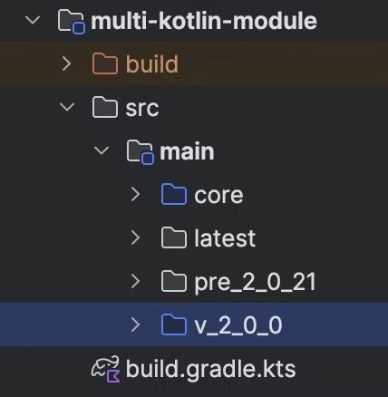

# Multi-kotlin-support-example

[Kotlin Advent Calendar 2024](https://qiita.com/advent-calendar/2024/kotlin) 20日目の記事、
「[Kotlin Compiler Plugin を複数の言語バージョンに対応する](TODO)」のサンプルプロジェクトです。

ステップごとに細かくコミットを分けていますので、適宜checkoutしながらご覧ください。

## ステップ1: 言語バージョンによるAPI差異を賢く吸収する

言語バージョン別にソースディレクトリが分かれていることは、`versions-root/libs.versions.toml` の中の
`kotlin` のバージョン定義を書き換えて Gradle Sync することで確認できます。

|     2.1.0(latest)      |         2.0.21 ~ 2.0.10          |         2.0.0         |
|:----------------------:|:--------------------------------:|:---------------------:|
|  |  |  |

VersionSpecificAPI の挙動に関して、言語バージョンを変えてそれぞれ `./gradlew run`
を実行すると異なる結果になることを確認できます。

| language-version | 2.1.0(latest)  |  2.0.21 ~ 2.0.10   |     2.0.0     |
|:----------------:|:--------------:|:------------------:|:-------------:|
|  message output  | latest Kotlin! | Kotlin pre 2.0.21! | Kotlin 2.0.0! |

## ステップ2: 言語バージョンを環境変数で切り替える

以下のように環境変数 `KOTLIN_VERSION` を用いてプロジェクトで使用する Kotlin を動的に切り替えることができます。

```shell
export KOTLIN_VERSION=2.0.0 
./gradlew run
```

## ステップ3: Gradle Plugin で適切な Compiler Plugin を自動選択する

Gradle Plugin 適用先のプロジェクトで使用している Kotlin のバージョンを取得するサンプルを含めています。
Gradle公式の Testkit を使用すると実行元の環境に一部依存する問題があり正しくバージョン取得ができなかったため、
[Gradle Testkit Support Plugin](https://github.com/autonomousapps/dependency-analysis-gradle-plugin/tree/main/testkit)
を用いてテストを実装しています。

```shell
./gradlew :multi-kotlin-gradle-plugin:functionalTest
```
